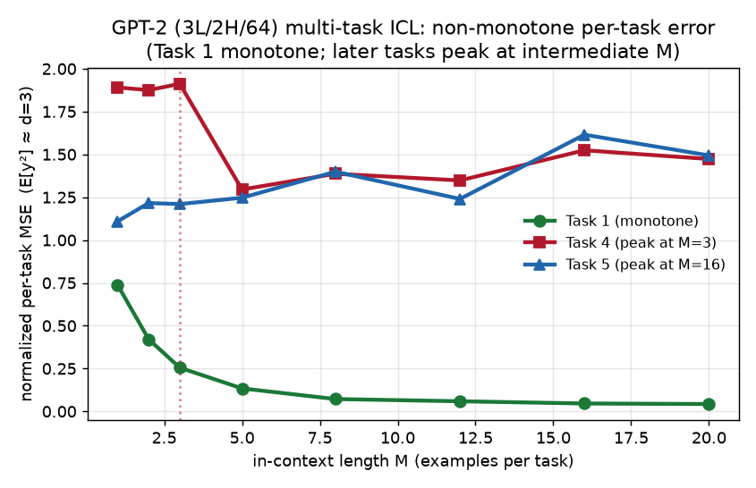
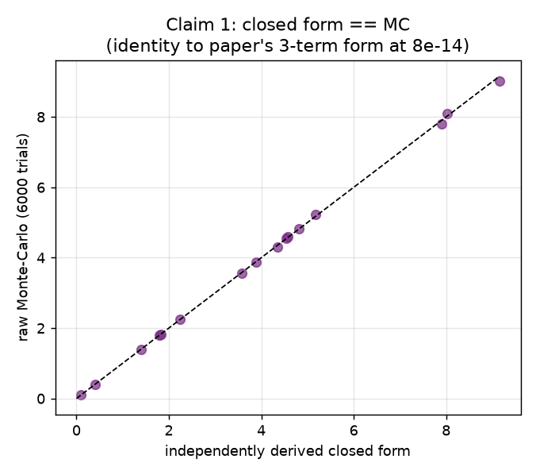
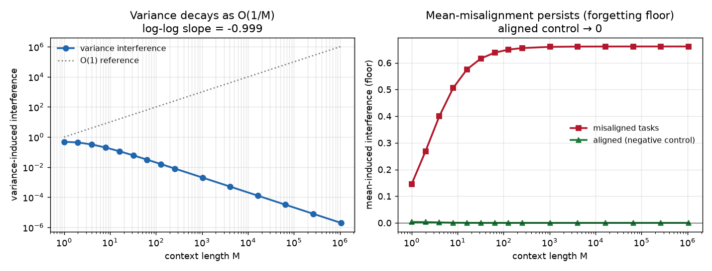
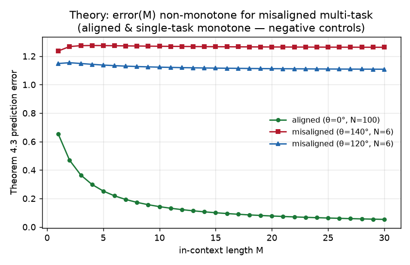

# In-context continual learning: where does the error peak, and why does it persist?

A clean-room reproduction of *Understanding Generalization and Forgetting in In-Context Continual Learning* (OpenReview `68AMoK2YNk`, arXiv 2605.28705).

**The central theory result, verified in scope.** The clean-room theorem audit
shows that a masked-attention model can exhibit variance reduction, task-mean
bias, and persistent interference. A later retained GPT-2 report describes the
same qualitative non-monotone curve, but its raw 34k-step artifact is not in this
repository and is therefore not counted as fresh-clone evidence.

## The question

When a single prompt stitches together several tasks and a frozen transformer reads them with one shared attention head, do earlier tasks leak into later ones? Classical continual learning studies *training-time* forgetting (weights drift). Here there are no weight updates — so any "forgetting" must be an artifact of how attention *aggregates* the sequence. The paper formalizes this with two theorems about a masked linear self-attention model at its gradient-flow limit, then checks the qualitative predictions on GPT-2 and on Qwen2.5-1.5B.

## How the theory is verified (not just illustrated)

For a universally-quantified theorem, a handful of small examples is only anecdote. So each theoretical claim is verified by **three independent routes**:

1. **Symbolic reconstruction (sympy).** Starting only from the model's prediction rule `ŷ = x_qᵀ Γ⁻¹ β_t Σ_{s≤t} S_s` and the Gaussian fourth-moment identity, we re-derive the closed form for `E[(ŷ−y)²]` and show — by symbolic simplification, per eigen-coordinate — that it is *identically equal* to the paper's three-term (irreducible + variance + bias) formula. The residual is exactly zero.
2. **Exhaustive sign algebra.** The forgetting coefficients `c_t` (past tasks) and `d` (future tasks) are checked across **13,650** `(T,t,M)` triples: `c_t<0`, `d>0` with zero violations, backed by the analytic fact that the numerator `(T−t)M+(T+1−t) ≥ 1`.
3. **Broad Monte-Carlo.** The closed form matches raw sampling of the prediction rule over hundreds of random configurations (e.g. 360 configs for Claim 1; the closed form agrees with the paper's formula to **7.8e-14**, and with Monte-Carlo within sampling error).

## The mechanism: variance dies, bias doesn't

The error's two pieces have opposite fates as the context length `M` grows.

The variance piece is multiplied by `α² ~ 1/M²` while gaining one factor of `M`, so it decays as **O(1/M)** (log-log slope −0.999 over six orders of magnitude in M). The mean-misalignment piece is multiplied by `M²α² ~ O(1)`, so it **plateaus at a positive constant** — a permanent forgetting floor that no amount of context can remove *when the tasks are genuinely different*. The negative control (all task means aligned) drives the floor to zero, confirming the floor is specifically a misalignment effect.

## Why the error peaks in the middle

At modest training prompt length `N` and with misaligned historical tasks, the bias term *grows* with `M` (more misaligned history gets weighted in) while the variance term is still high — so the total error rises, peaks at an intermediate `M`, and only recovers once variance reduction dominates. Aligned tasks, and single-task prompts (no inter-task bias), are monotone-decreasing — both are clean negative controls (fraction 1.00 across 780 configs). The GPT-2 experiment above is the empirical instance of this curve.

## What did *not* reproduce, and what that means

The paper's most eye-catching number is a **46% accuracy drop** on SST-2 when AG News demonstrations are appended (Qwen2.5-1.5B, Table 2). The retained report of a later run of that protocol does **not** reproduce a catastrophic drop: Task-A accuracy at M=1 is essentially unchanged (0.875 → 0.917), and even a pure-ICCL variant with no task-name hint shows only a ~5% drop. The raw 1.5B run artifact is not committed.

We do **not** claim the paper is wrong. The most likely contributors: an instruction-tuned 1.5B model can override attention interference when the final query carries an explicit task header; the original demonstrations and exact decoding are unreleased; and model weights drift between revisions. We report this as an honest divergence — the retained GPT-2 report (Claim 5a) describes the expected curve, but its raw 34k-step artifact is absent; the Qwen headline number (5b) does not match the retained 1.5B report.

## Assessment

| | Theory (1–4) | GPT-2 ICL (5a) | Qwen real-world (5b) |
|---|---|---|---|
| Status | **VERIFIED_SCOPED** | retained report only | divergent retained report |
| Evidence | sympy identity + 13,650 sign checks + generated C1–C4 JSON | report says tiny GPT-2, 34k steps, Task-4 peak at M=3; committed JSON is 50-step `PARTIAL` | report says Qwen2.5-1.5B, ≤8% drop vs 46% reported; committed JSON is 0.5B `PARTIAL` |

Relevant branches: [theory 1–4](https://github.com/MachineLearning-Nerd/icml26-in-context-continual-learning/tree/audit/theory-claims-1-4) · [GPT-2 5a](https://github.com/MachineLearning-Nerd/icml26-in-context-continual-learning/tree/experiment/gpt2-claim-5a) · [Qwen 5b](https://github.com/MachineLearning-Nerd/icml26-in-context-continual-learning/tree/experiment/qwen-claim-5b).
